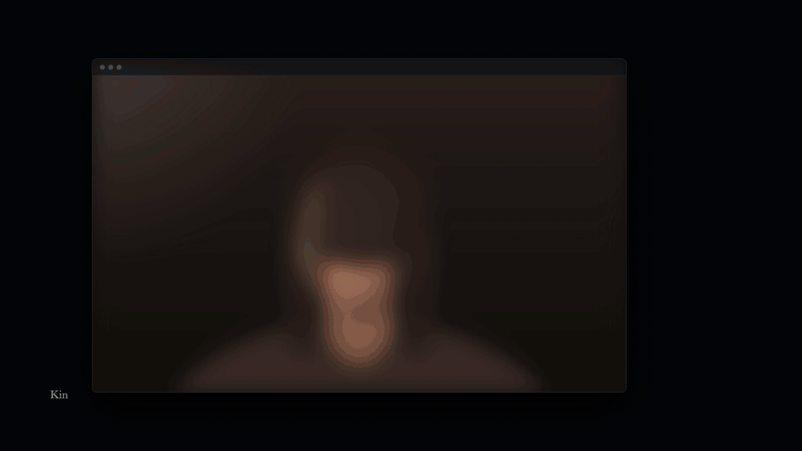

<p align="center"></p>
<h1 align="center">Kin</h1>
<p align="center"><em>As close as light allows.</em></p>

<p align="center">Video calls for Mac and Android that feel like the same room. Your voice arrives exactly as the microphone heard it. The picture is the one your camera saw. Between two people, the only delay we accept is the speed of light.</p>

<p align="center">
  <a href="https://kin.tokkah.com">Download for Mac</a> &middot;
  <a href="https://kin.tokkah.com">Download for Android</a> &middot;
  <a href="https://kin.tokkah.com/#waitlist">Not on a Mac? Leave your name</a> &middot;
  <a href="https://kin.tokkah.com/ad/kin-ad">Watch the film (75 s)</a>
</p>

<p align="center">
  <a href="https://github.com/deshmukhpatel98/tokkah/releases"></a>
  <a href="LICENSE"></a>
  <a href="https://kin.tokkah.com"> </a>
  <a href="https://github.com/deshmukhpatel98/tokkah/actions"></a>
</p>

## Why Kin

Every video call you have ever made runs on a design from 2011 that spends your face when the network dips: the picture goes soft, the voice gets invented, and you end up talking over each other. Kin does the opposite. Quality is a constant. Time is the only thing we ever spend.

- **Call a person, not a room.** Type a name and their Mac rings. No link to paste, no account to make, no waiting room to sit in.
- **Green means they can hear you.** A soft light at the edge of the window: green while you speak, blue while you listen, rising and falling with your voice.
- **One voice at a time.** Kin gives the floor to whoever is speaking, the way a room does. Nobody talks over anybody, and nobody hears themselves come back.
- **The voice is the recording.** 48 kHz PCM, losslessly compressed, encrypted per packet. No codec ever touches it.
- **Straight between two Macs.** A Cloudflare Worker introduces you and steps aside; audio and video travel directly over UDP. Where two routers refuse a direct path, a relay forwards packets it has no key for.
- **Measured, every release.** Every claim in this repository ships with the number that proves it and the command that reproduces it.

## Install

```bash
curl -fsSL https://room.tokkah.com/macos/install.sh | sh
```

A file fetched by `curl` is never quarantined, so Gatekeeper is never consulted (details in [docs/INSTALL.md](docs/INSTALL.md)).

Or download the `.dmg` from [kin.tokkah.com](https://kin.tokkah.com). macOS will ask for a one-time "Open Anyway" click under System Settings → Privacy & Security because the app is self-signed rather than notarized ([docs/INSTALL.md](docs/INSTALL.md) explains why).

macOS 14+, Apple silicon, about 2 MB, free, no account.

**Android** is here too: download the `.apk` from [kin.tokkah.com](https://kin.tokkah.com) (Android 10+, about 70 MB). Android asks once to allow installs from your browser, because it comes from us rather than from Play; the app keeps itself up to date after that. The source is under [`android/`](android/).

## Make a call

Both people run Kin. Type a name to ring someone directly, or type a room word to meet.

```bash
tk --room our-room --video camera    # camera on
tk --room our-room                   # audio only
tk                                   # the window asks for a name or room
```

Room names are the capability: anyone who knows one can join, and an invite travels as `tokkah://join/<room>`.

`tk --help` is the reference and is kept honest by construction: **an unknown option is refused, not ignored.** That is not fastidiousness — it has happened twice in this project that an A/B experiment silently compared an arm against itself, because a misspelled flag did nothing quietly and the damaged arm ran with its impairment switched off.

## How it works

- **Rendezvous** via one Cloudflare Worker and two Durable Object classes ([`tape-app/src/worker.ts`](tape-app/src/worker.ts)). The server introduces the two Macs and steps aside; media never touches it unless two routers refuse a direct path and require a TURN relay.
- **Direct UDP**, one socket carrying both audio and video ([`mac/Sources/tk/Net.swift`](mac/Sources/tk/Net.swift)), so there is one port and one hole to punch.
- **48 kHz 16-bit PCM**, losslessly compressed 2.6× by fixed-order prediction and Rice coding ([`mac/Sources/tk/Lpc.swift`](mac/Sources/tk/Lpc.swift)), packed at 32 samples (0.667 ms) of audio per datagram. No lossy codec ever touches it.
- **Loss repair** via a second copy of each packet offset in time ([DESIGN.md](DESIGN.md) §17.86), recovering 94.8% at 1% uniform loss for 1.2 ms of added buffer, switching off during bursts.
- **Video** via H.264 High through VideoToolbox ([`mac/Sources/tk/Video.swift`](mac/Sources/tk/Video.swift)), visually lossless (45.5 dB PSNR at ~1.19 Mbps, 30 fps sustained), never bit-exact.
- **Encryption** via X25519 + ML-KEM-768 post-quantum hybrid handshake and AES-256-GCM per packet ([`mac/Sources/tk/Crypto.swift`](mac/Sources/tk/Crypto.swift)), using two keys (one per direction) to eliminate nonce reuse.
- **The floor and edge light**: one open microphone at a time ([`mac/Sources/tk/Audio.swift`](mac/Sources/tk/Audio.swift)), giving the floor to whoever is speaking so echo has nothing to feed on, with a linear echo canceller ([`mac/Sources/tk/Aec.swift`](mac/Sources/tk/Aec.swift)) for what leaks on speakers; the edge light glows green while you speak and blue while you listen ([`mac/Sources/tk/Controls.swift`](mac/Sources/tk/Controls.swift)).
- **Signed self-updater** verifying Ed25519 signatures ([`mac/Sources/tk/Update.swift`](mac/Sources/tk/Update.swift)) and swapping the bundle atomically via `renamex_np`; the private signing key is not in this repo ([GOVERNANCE.md](GOVERNANCE.md#releases-and-the-keys-that-gate-them)).

## What is measured

This project's one real rule is that a claim ships with the number that proves it. The full table of measurements is in [docs/MEASURED-KIN.md](docs/MEASURED-KIN.md).

| Claim | Measured | Where |
|---|---|---|
| Mouth to ear | **9.23 ms**, fully attributed with 0.08 ms unaccounted: `cap→send 1.67 · recv→play 3.01 · mic 1.88 · spk 2.58`. **4.46 ms of that 9.23 is the microphone and the speaker** — hardware nobody can optimise | [DESIGN.md](DESIGN.md) §17.108 |
| Audio format | 48 kHz **16-bit PCM, losslessly compressed 2.6×** by fixed-order prediction + Rice coding (the FLAC/Shorten subset, no lookahead, so it costs no latency by construction): **1.16 Mbps** each way, was 1.64 uncompressed. 137,005 packets round-tripped with **0 mismatches** | [`mac/Sources/tk/Lpc.swift`](mac/Sources/tk/Lpc.swift), `tk --selftest-lpc` |
| Encryption costs nothing | X25519 + ML-KEM-768 (post-quantum hybrid) + AES-256-GCM per packet, handshake signed by the device key, replay window: **0.78 µs** to seal 276 bytes, worst of 300,000 at 15 µs, against a 1333 µs deadline — 0.06% typical | [`mac/Sources/tk/Crypto.swift`](mac/Sources/tk/Crypto.swift) |
| Your voice is untouched | duplex gate: **19.3 dB** of attenuation while only the far end is talking, **0.0001%** worst-sample difference while you talk — bit-for-bit | `tk --gate-test` |
| Video | H.264 High through VideoToolbox: **45.5 dB PSNR at ~1.19 Mbps, 30 fps sustained**. Glass-to-glass **~34.8 ms** in the shipping default (5.6 ms capture→decoded, 29.2 ms decoded→glass) | [DESIGN.md](DESIGN.md), [`mac/Sources/tk/Video.swift`](mac/Sources/tk/Video.swift) |
| Answering a ring | **429 ms** to first picture on a real answered ring | [`mac/Sources/tk/main.swift`](mac/Sources/tk/main.swift) |

### What these numbers are not

Almost every figure above is a **pipeline** number, measured **between two
processes on one Mac**. The network contributes nothing and both ends share one
clock. That is a deliberate instrument — it isolates the part that is not the
speed of light — but it means they are not a claim about what a call between two
people in two places costs.

Being exact about which is which:

- **Loopback** (two processes, one machine): mouth-to-ear, glass-to-glass, the
  audio format figures, the duplex gate, the video PSNR.
- **Injected impairment** (delay, jitter and loss added on one Mac — never a
  constant-delay pipe): the distance figures. A Delhi↔Netherlands path modelled
  at 45 ms one-way gives **59.2 ms** mouth-to-ear; the antipodes at 100 ms
  one-way give **116.7 ms**, leaving 33 ms of headroom against the project's
  150 ms goal. The download page states plainly that these two are simulated,
  and that real distance "will be worse in ways a rig cannot invent".
- **Real hardware, black box**: camera first frame, launch and window timings.
- **Live production**: the **346 ms** cancel/decline, and the server-side
  measurements in [RINGING.md](RINGING.md) (Durable Object cold start 1108 ms
  median over 27 fresh objects; warm round trip 127 ms median).

So: there is currently **one live-production latency receipt for a media
action** in this project, and it is the 346 ms one. A real two-Macs-two-places
mouth-to-ear has not been measured. That is the honest state, it is the next
thing worth measuring, and no number here should be read as if it had been.

Video is *visually* lossless at best and never bit-exact — 1080p60 raw is about
1.5 Gbps, so the audio promise is simply not available for the picture. The
audio deserves the same precision: 16-bit is lossless with respect to **what the
microphone captured**, and lossy with respect to the float the OS hands over.
The project's own word for that is **"transparent, not lossless"**, and it is the
better word.

## Known limitations

Named here rather than discovered later:

- **Mac (Apple silicon, macOS 14+) and Android (10+).** No Intel, Windows, Linux or iPhone build yet.
- **Two people per call.** No group calls.
- **Not notarized.** One Gatekeeper click on the `.dmg` route (see [docs/INSTALL.md](docs/INSTALL.md)).
- **Your voice is not processed.** No noise suppression, no automatic gain, no voice effects; the only filter on the microphone is a 65 Hz high-pass for table thumps. Echo is handled by turn-taking first (one open microphone at a time) and a linear echo canceller second, for what leaks on speakers ([`mac/Sources/tk/Audio.swift`](mac/Sources/tk/Audio.swift), [`mac/Sources/tk/Aec.swift`](mac/Sources/tk/Aec.swift)). Headphones change the call: with no acoustic path there is nothing to gate, so both microphones stay open.
- **No real two-machine latency measurement.** Every media figure above is loopback or injected impairment (see [What these numbers are not](#what-these-numbers-are-not)).
- **A first call between strangers through a server that lies about keys is the one remaining MITM case.** Subsequent calls pin keys, and an eight-character voice code verifies first calls ([`mac/Sources/tk/Crypto.swift`](mac/Sources/tk/Crypto.swift)).
- **The window is invisible to accessibility tooling.** Kin reports zero accessibility elements ([LAUNCH.md](LAUNCH.md)); a real defect, not a design choice.
- **CI cannot make a call.** [`.github/workflows/ci.yml`](.github/workflows/ci.yml) verifies builds and offline tests, but audio and video are checked by hand on hardware ([`mac/tools/`](mac/tools)).
- **Releases are tagged and listed under [GitHub Releases](https://github.com/deshmukhpatel98/tokkah/releases)**; the `.dmg` and the signed manifest are served from [kin.tokkah.com](https://kin.tokkah.com).
- **Documentation is split by era.** [docs/BROWSER-ERA.md](docs/BROWSER-ERA.md) and [MEASURED.md](MEASURED.md) cover the browser product; [DESIGN.md](DESIGN.md) covers both; native Mac details are in [docs/ENGINEERING.md](docs/ENGINEERING.md).

## The goal

Under 150 milliseconds, anywhere on Earth. Between two people there is exactly one delay that is real: the time light needs to cross the distance. Everything else is a defect, and we are removing it — measured on live calls, every release.

For the record so far, see [LATENCY-150.md](LATENCY-150.md): the one real cross-planet measurement (Delhi ↔ Netherlands, 127 ms mouth-to-ear) was taken in the browser era and does not carry over to the Mac app; the Mac app's own long-distance number is the next thing worth measuring.

## Self-hosting

The Worker is in this repo and deploys on a **free** Cloudflare account.
[SELF-HOSTING.md](SELF-HOSTING.md) has the full walkthrough, including optional
TURN credentials and pointing your own build at your deployment.

## License

Dual-licensed, and for almost everyone the answer is "free, go ahead".

**Free, under the [GNU AGPL v3](LICENSE)** — OSI-approved. Use it, deploy it,
fork it, sell a service built on it. Two light obligations: if you modify it and
serve those modifications to other people, publish your modified source too; and
**credit it** with one line in an About screen, credits page or footer, linked
([ATTRIBUTION.md](ATTRIBUTION.md)). That second one applies only to products
other people use — running it for yourself or your team requires nothing.

**Commercially, under a paid license** — for shipping inside a
**closed-source** product, or running a modified version as a service without
publishing your changes. See [LICENSE-COMMERCIAL.md](LICENSE-COMMERCIAL.md) or
write to licensing@tokkah.com.

Contributions carry a DCO sign-off plus a licensing grant, both explained in
[CONTRIBUTING.md](CONTRIBUTING.md). Third-party components: [NOTICE](NOTICE) —
the shipped app has **zero runtime dependencies**. Everything published before
commit `6375ae4` was MIT-licensed, and that grant stands permanently for those
versions.

## Help, and who is behind this

- **Something broken?** [Open a bug report](https://github.com/deshmukhpatel98/tokkah/issues/new?template=bug_report.yml).
- **A question that is not a bug?** [Discussions](https://github.com/deshmukhpatel98/tokkah/discussions), or [SUPPORT.md](SUPPORT.md).
- **A security problem?** Do not open a public issue — [SECURITY.md](SECURITY.md).
- **Want to contribute?** [CONTRIBUTING.md](CONTRIBUTING.md). Be warned that the
  bar is a measurement, including for the maintainer.

This is **a one-person project, in the open since August 2026**.
[GOVERNANCE.md](GOVERNANCE.md) says who decides what, how a pull request gets
accepted, what a fork can and cannot do with the signing keys, and what
happens to all of this if the maintainer disappears.

[OPENNESS.md](OPENNESS.md) is the scorecard the project grades itself against —
can a stranger license it, deploy it, understand it, contribute to it, trust it —
with the command that proves each row.

If a call on Kin felt closer than it should have, a star here helps the next person find it.
